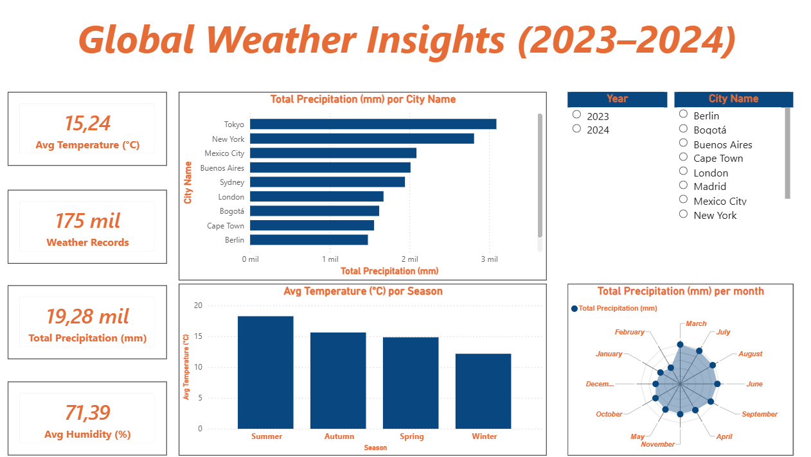

# Data Insights & Analysis

## Objective
Analyze historical weather data (2023–2024) to identify temperature and precipitation patterns across major global cities.

## Key Questions
- Which cities experienced the highest total precipitation?
- Are there noticeable differences between 2023 and 2024?

## Key Findings
- Tokyo and New York show significantly higher precipitation levels compared to European cities.
- Seasonal variability is more pronounced in cities with continental climates.
- Based on the analysis of historical weather data (2023–2024), New York shows the highest temperature variability. 

## Business Interpretation
These patterns could support:
- Urban planning decisions
- Climate risk assessments
- Seasonal demand forecasting for weather-dependent industries

## Dashboard Preview

